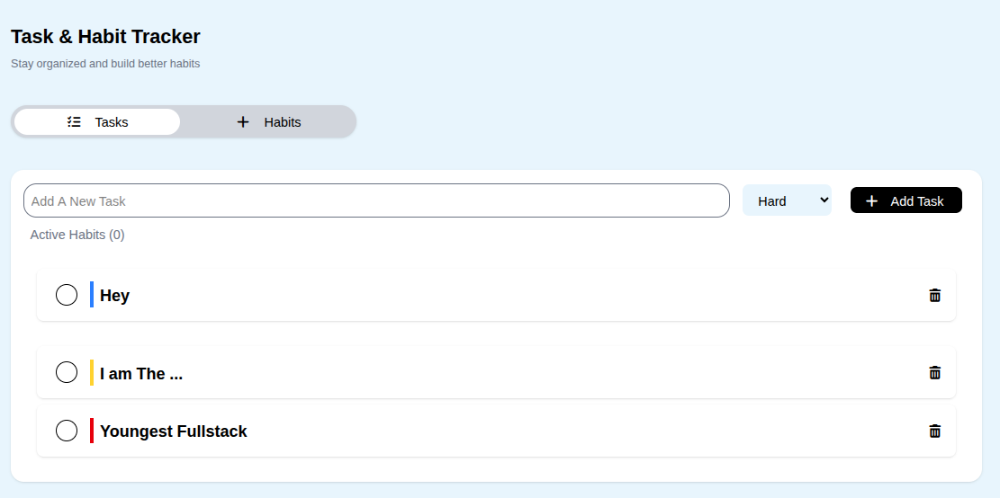

# Food Store Page

A simple browser-based online food store page built with vanilla JavaScript.




## About

This was one of my mini projects in my JavaScript learning roadmap.

Finally I can say this project is the first semi-real project in my learning roadmap it has two sections habits and tasks ( later i built a specific task management with Typescript ) this was the first version you can find ع غير عادتي a simple and calm UI with the same and suitable colors for visual calm

Still, I like this project because it feels like my first semi-real JavaScript project. At that point I was still learning the basics of architecture and project planning, but finishing it gave me the feeling that I had actually built something.

Every Project I say "Still, I like this project because it feels like my first semi-real JavaScript project" but this project i don't remember that i build it actually 🤣🤣🤣

---

## Features

* RAdd/Remove/Check Task
* Validation for duplicated tasks
* habit chek in daily
But it is static because at this time I didn't learn time in js yet but you can find this feature in my to-do tracker built with ts

---

## Built With

* **HTML5** — page structure
* **CSS3** — styling
* **TailwindCSS** — UI design and utility classes
* **JavaScript** — application logic and interactions

---

## Getting Started

Open the live version here:

[Launch App →](https://logwithjo.github.io/Tracker)

---

## Project Structure

```text
.
├─ index.html
├─ main.js
├─ README.md
├─ css/
│  ├─ all.min.css
│  └─ style.css
└─ webfonts/
   ├─ fa-brands-400.woff2
   ├─ fa-regular-400.woff2
   ├─ fa-solid-900.woff2
   └─ fa-v4compatibility.woff2
```

---

## What I Learned

* Don't merge **Two Ideas in one Project**
* The importance of calm UI in user usage


> Getting 1 percent better every day counts for a lot in the long run.
